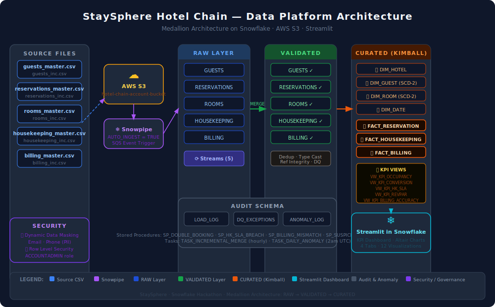
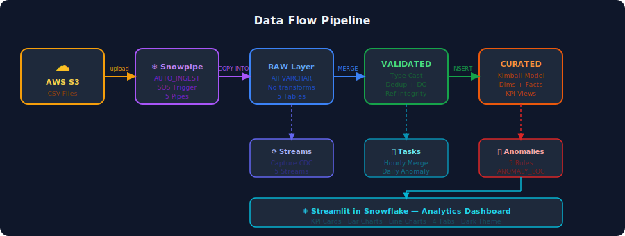

# 🏨 StaySphere — Hotel Chain Operations Data Platform

> A unified Snowflake-based data platform for a multinational hotel chain, built with Medallion Architecture (RAW → VALIDATED → CURATED), AWS S3 auto-ingestion via Snowpipe, Kimball dimensional modeling, and a Streamlit analytics dashboard.

---

## 📐 Architecture



---

## 🔄 Data Flow



---

## 🚀 Tech Stack

| Layer | Technology |
|---|---|
| Cloud Storage | AWS S3 |
| Data Warehouse | Snowflake |
| Ingestion | Snowpipe (AUTO_INGEST via SQS) |
| Transformation | Snowflake SQL (MERGE, CTAS) |
| Orchestration | Snowflake Tasks + Streams |
| Modeling | Kimball Dimensional (Star Schema) |
| Anomaly Detection | Snowflake Stored Procedures |
| Dashboard | Streamlit in Snowflake + Altair |
| Security | Dynamic Data Masking + Row Level Security |

---

## 📁 Repository Structure

```
staysphere/
│
├── staysphere_complete.sql       # Full Snowflake backend SQL (all 11 sections)
├── staysphere_streamlit.py       # Streamlit in Snowflake dashboard
│
├── architecture.svg              # System architecture diagram
├── dataflow.svg                  # Data flow pipeline diagram
│
├── data/
│   ├── guests_master.csv
│   ├── reservations_master.csv
│   ├── rooms_master.csv
│   ├── housekeeping_master.csv
│   └── billing_master.csv
│
└── README.md
```

---

## 🗂️ Data Domains (5 CSV Sources)

| Domain | File | Columns |
|---|---|---|
| Guests | `guests_master.csv` | guest_id, name, dob, gender, email, phone, address, city, country, loyalty_tier, registration_date |
| Reservations | `reservations_master.csv` | reservation_id, guest_id, room_id, check_in_date, check_out_date, booking_channel, booking_time, cancellation_time, status |
| Rooms | `rooms_master.csv` | room_id, hotel_id, room_type, floor, capacity, amenities, status, base_price |
| Housekeeping | `housekeeping_master.csv` | task_id, room_id, task_type, assigned_staff, scheduled_time, start_time, end_time, issue_detected_flag, status |
| Billing | `billing_master.csv` | bill_id, reservation_id, guest_id, total_amount, taxes, discounts, payment_mode, payment_time, is_flagged |

---

## 🏗️ Medallion Architecture

### 🥉 RAW Layer
- All columns stored as `VARCHAR` — no transformations
- Columns match CSV exactly so Snowpipe `COPY INTO` works without mapping
- 5 tables: `GUESTS`, `RESERVATIONS`, `ROOMS`, `HOUSEKEEPING`, `BILLING`

### 🥈 VALIDATED Layer
- Type casting with `TRY_TO_DATE`, `TRY_TO_TIMESTAMP`, `TRY_TO_DECIMAL`
- Deduplication using `ROW_NUMBER() OVER (PARTITION BY <natural_key>)`
- Data quality filters: valid emails, checkout > checkin, capacity > 0
- Value normalisation: `INITCAP` for status, `UPPER` for task_type, `Y/N → BOOLEAN`
- Referential integrity exceptions logged to `AUDIT.DQ_EXCEPTIONS`

### 🥇 CURATED Layer (Kimball Star Schema)

```
DIM_HOTEL ──┐
DIM_GUEST ──┤──► FACT_RESERVATION
DIM_ROOM ───┤──► FACT_HOUSEKEEPING
DIM_DATE ───┘──► FACT_BILLING
```

- `DIM_GUEST` and `DIM_ROOM` implement **SCD Type 2** (effective_from, effective_to, is_current)
- `DIM_DATE` covers 10 years (2020–2030) with date_sk as `YYYYMMDD` integer
- Facts join to dims via surrogate keys (`guest_sk`, `room_sk`)

---

## ⚙️ Ingestion Pipeline

```
S3 Bucket  →  SQS Event  →  Snowpipe  →  RAW Tables
                                ↓
                           Streams (CDC)
                                ↓
                      TASK_INCREMENTAL_MERGE (hourly)
                                ↓
                         VALIDATED Tables
                                ↓
                          CURATED Facts
```

### AWS Setup Steps
1. Run `CREATE STORAGE INTEGRATION S3_INT` in Snowflake
2. Run `DESC INTEGRATION S3_INT` — copy `STORAGE_AWS_IAM_USER_ARN` and `STORAGE_AWS_EXTERNAL_ID`
3. In AWS IAM → update the role trust policy with those values
4. Create 5 Snowpipes with `AUTO_INGEST = TRUE`
5. Run `SHOW PIPES` → copy each pipe's `notification_channel` (SQS ARN)
6. In AWS S3 → bucket → Event Notifications → add PUT event → target each SQS ARN

---

## 📊 KPI Views (5 KPIs)

| KPI | Definition | View |
|---|---|---|
| Room Occupancy Rate | Booked rooms / Total rooms × 100 | `VW_KPI_OCCUPANCY` |
| Booking Conversion | Confirmed / Total reservations × 100 | `VW_KPI_CONVERSION` |
| HK SLA Compliance | Tasks ≤120 min / Total tasks × 100 | `VW_KPI_HK_SLA` |
| RevPAR | Total net revenue / Total available rooms | `VW_KPI_REVPAR` |
| Billing Accuracy Index | 1 − (Flagged bills / Total bills) | `VW_KPI_BILLING_ACCURACY` |

---

## 🚨 Anomaly Detection (5 Rules)

| Rule | Description |
|---|---|
| `SP_DOUBLE_BOOKING` | Overlapping reservations for the same room |
| `SP_HK_SLA_BREACH` | Cleaning task took more than 120 minutes |
| `SP_MAINTENANCE_OVERDUE` | Issue flagged but not resolved within 24 hours |
| `SP_BILLING_MISMATCH` | Billed amount differs from base_price × nights + taxes − discounts by > $10 |
| `SP_SUSPICIOUS_CANCELLATION` | Same guest cancels more than 3 reservations within 24 hours |

All anomalies are logged to `STAYSPHERE.CURATED.ANOMALY_LOG` and run automatically via `TASK_DAILY_ANOMALY` at 2am UTC.

---

## 🔒 Security & Governance

- **Dynamic Data Masking** on `email` and `phone` columns in `DIM_GUEST` — only `ACCOUNTADMIN` sees raw values
- **Row Level Security** via Snowflake Row Access Policies
- **Audit Trail** — `AUDIT.LOAD_LOG`, `AUDIT.DQ_EXCEPTIONS` for every batch
- **SCD-2** history preserved on `DIM_GUEST` and `DIM_ROOM` for full change tracking

---

## 📈 Streamlit Dashboard

Paste `staysphere_streamlit.py` into **Streamlit in Snowflake** (Snowsight → Streamlit → + New).

**4 tabs, 12 charts:**

| Tab | Charts |
|---|---|
| 📋 Reservations | Status bar · Monthly bookings · Channel bar · Length of stay line |
| 🛏️ Rooms & Guests | Top 5 guests · Top 5 rooms · Loyalty tier bar · Room type bar |
| 🧹 Housekeeping | Task type/status · Staff workload · Duration vs SLA · Monthly SLA trend |
| 💰 Revenue | RevPAR line · Payment method bar · Billing accuracy · Anomaly summary |

---

## 🛠️ How to Run

### Step 1 — Upload CSVs to S3
```bash
aws s3 cp guests_master.csv      s3://hotel-chain-account-bucket/guests/
aws s3 cp reservations_master.csv s3://hotel-chain-account-bucket/reservations/
aws s3 cp rooms_master.csv        s3://hotel-chain-account-bucket/rooms/
aws s3 cp housekeeping_master.csv s3://hotel-chain-account-bucket/housekeeping_maintenance/
aws s3 cp billing_master.csv      s3://hotel-chain-account-bucket/billing_payments/
```

### Step 2 — Run SQL in Snowflake
Open `staysphere_complete.sql` in Snowsight and run all sections top to bottom.

### Step 3 — Verify Data
```sql
SELECT 'RAW GUESTS', COUNT(*) FROM STAYSPHERE.RAW.GUESTS
UNION ALL SELECT 'VAL GUESTS', COUNT(*) FROM STAYSPHERE.VALIDATED.GUESTS
UNION ALL SELECT 'FACT RESERVATION', COUNT(*) FROM STAYSPHERE.CURATED.FACT_RESERVATION;
```

### Step 4 — Launch Dashboard
Open Streamlit in Snowflake → paste `staysphere_streamlit.py` → Run.

---

## 📋 Deliverables

- ✅ COPY INTO ingestion pipelines (Snowpipe + AUTO_INGEST)
- ✅ RAW → VALIDATED → CURATED medallion modeling
- ✅ SCD-2 dimensions (DIM_GUEST, DIM_ROOM)
- ✅ Stored procedures for 5 anomaly rules
- ✅ Incremental MERGE via Streams + Tasks
- ✅ 5 KPI views
- ✅ Dynamic data masking (PII)
- ✅ Audit logging
- ✅ Streamlit analytics dashboard

---

## 👤 Author

**StaySphere Hackathon Project**  
Built on Snowflake · AWS S3 · Streamlit
